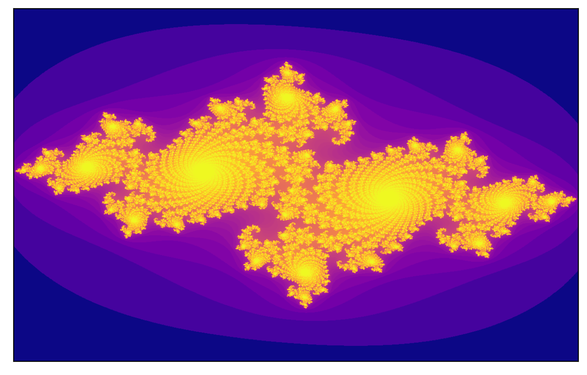
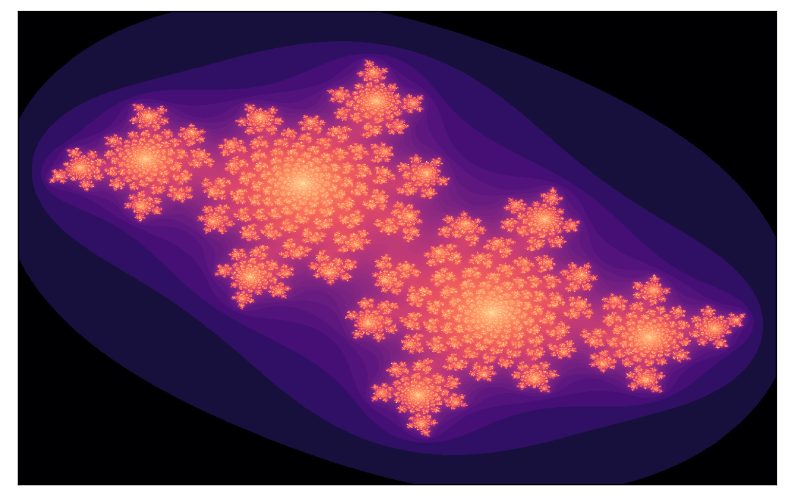

# Julia and Mandelbrot Set Visualizer

This is a simple web app that allows the user to visualize Julia sets and the Mandelbrot set. A vectorized implementation of the escape-time algorithm is used to plot the figures. This app was used in my report in my Complex Analysis class.

Accessing the App
=================

To access this app, you can either

1. Clone the repository. Then, run 

`pip install -r requirements.txt`

on the terminal. It is ideal to create a virtual environment first before proceeding to the installation of the required libraries. Once done, you can then run

`streamlit run app.py`

on the terminal and use the app on your local server.

OR

2. Access the app via Streamlit Sharing through this [link](https://share.streamlit.io/arnelmalubay/julia-mandelbrot-visualizer/main/app.py).