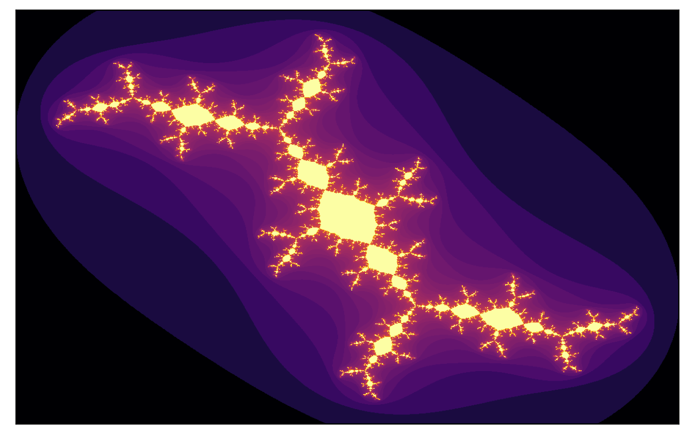
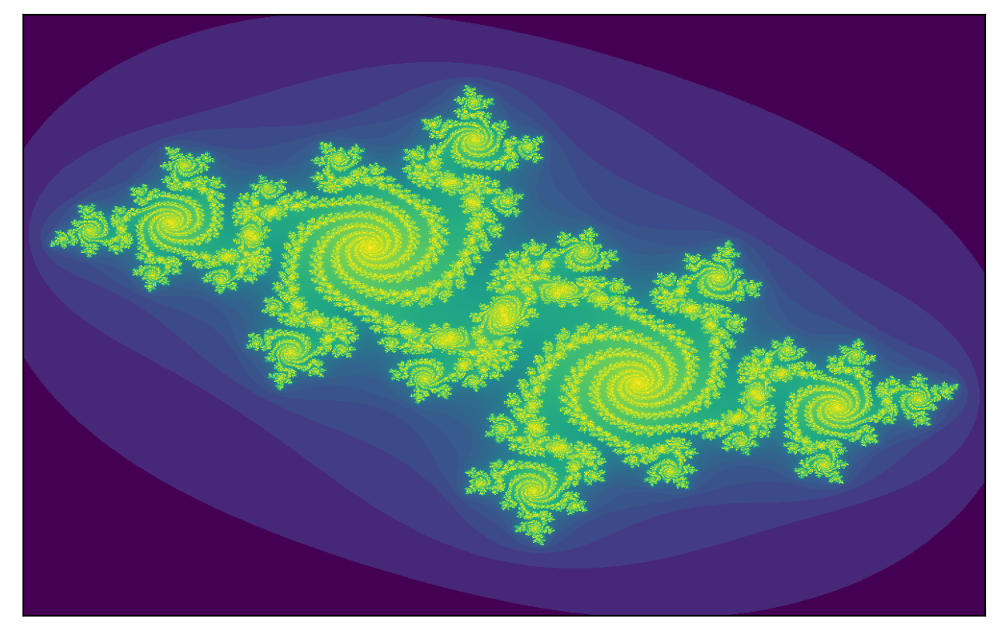
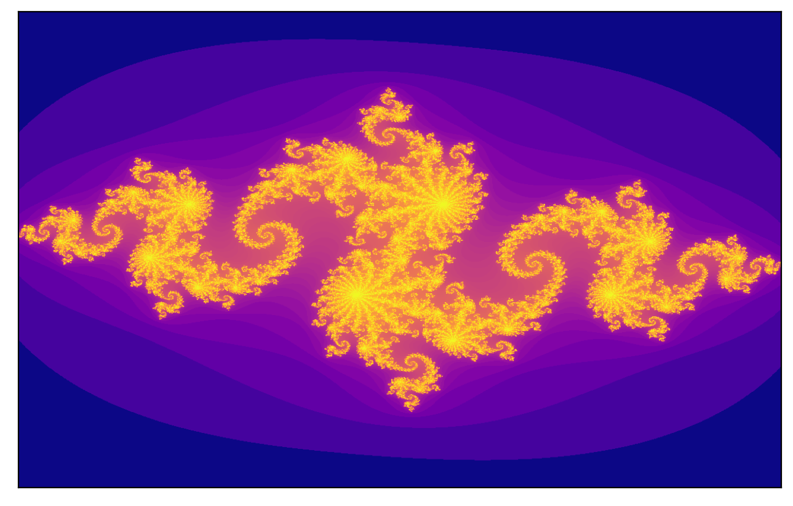

# Julia and Mandelbrot Set Visualizer

Julia set for c = -0.11564378757515037 + 0.8690819138276553i

Julia set for c = -0.512511498387847167 + 0.521295573094847167i

Julia set for c = -0.5012149298597195 - 0.5637838176352705i

Julia set for c = -0.8 + 0.156i

This is a simple web app that allows the user to visualize Julia sets and the Mandelbrot set. A vectorized implementation of the escape-time algorithm is used to plot the figures.

To access this app, you can either

1. Clone the repository. Then, run 

`pip install -r requirements.txt`

on the terminal. It is ideal to create a virtual environment first before proceeding to the installation of the required libraries. Once done, you can then run

`streamlit run app.py`

on the terminal and use the app on your local server.

OR

2. Access the app through Streamlit Sharing via this link: 